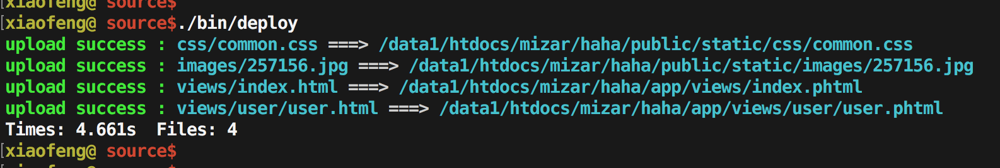

## Deploy-kit

A nice deployment tool supports ftp and sftp. Used directly or with built-in plugins, such as webpack-plugin.


```
yarn add deploy-kit --dev
```




## basic usage

```
const client = require('deploy-kit')

client = client.sftp({
  // sever account, address, port
  server: 'user:pwd@10.133.3.4:22',
  // deploy all files in the directory
  workspace: __dirname + '/dist',
  // ignore the matched files (glob pattern: https://github.com/isaacs/node-glob#glob-primer)
  // support array of glob pattern
  ignore: '**/*.map',
  // where the files are deployed
  deployTo: '/data1/htdocs/testapp',
  // you can specify different place for each files
  rules: [
    {
      test: /dist\/(.*)$/,
      // $1, $2... means the parenthesized substring matches
      // [$n] will be replaced with matched string
      dest: 'public/static/[$1]'
    },
    {
      test: /views\/((?:[^/]+\/)*?[^\/]+).html$/,
      dest: 'app/views/[$1].phtml'
    }
  ]
})

client.upload()
```


## using cli

```
./bin/deploy --server user:pwd@server_address:port --ignore **/*.map ./dist /data1/htdocs/testapp
```

#### cli options:
```

  Usage: deploy [options] [workspace] [deployTo]


  Options:

    -V, --version           output the version number
    -c, --config <path>     use configuration from this file
    -s, --server <address>  server account, address. (e.g. user:pwd@address:port)
    -i, --ignore <pattern>  ignore the matched files
    -h, --help              output usage information

  Examples:

    // use configuration from a file
    $ deploy --config deploy.js
    // deploy files in ./dist to /data1/htdocs/testapp on 10.13.1.2
    $ deploy -s user:pwd@10.13.1.2:22 --i *.map ./dist /data1/htdocs/testapp

  version: 2.1.2
```

#### using config file

you can use configuration file instead of cli args. Just create a `deploy.js` file in the root directory of you project and exports your configuration like this:

```
module.exports = {
  server: '',
  workspace: '',
  ignore: '',
  deployTo: '',
  rules: []
}
```

Runing directly without any arg.

```
./bin/deploy
```

If you prefer to place the configuration file in another place, you can use `-c, --config <path>` option like this:

```
./bin/deploy --config ./config/your_conf.js
```

## used with webpack plugin

```
const deployConfig = require('./deploy.js')
const DeployPlugin = require('deploy-kit/plugins/webpack-plugin')

// webpack configuration
moudle.exports = {
  ...
  plugins: [
    new DeployPlugin(deployConfig)
  ]
}
```
